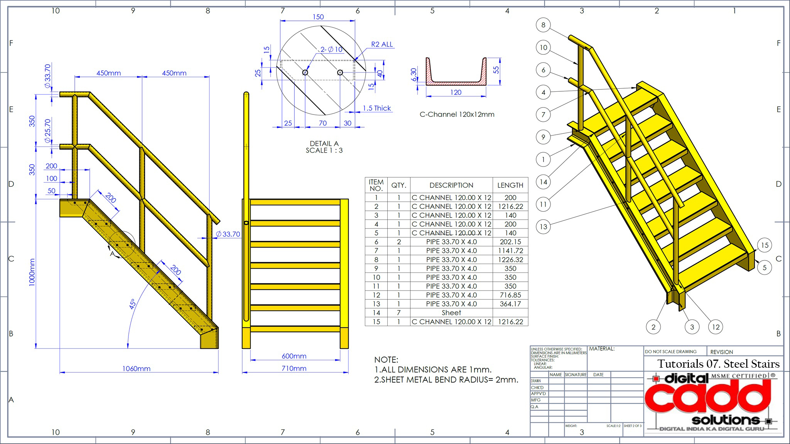

````markdown
<div align="center">

# 🪜 Steel Stairs – SOLIDWORKS Weldments Project

📘 *Tutorial 07: Steel Staircase Design using SOLIDWORKS Weldments*  
🎓 From the SOLIDWORKS training course by **Digital CADD Solutions**  
👨‍💻 Created by: Amir Souhail


</div>

---

## 🧾 Project Description

This repository contains the design files, weldment structures, and technical drawing for a **steel staircase** fabricated using **C-Channels** and **circular pipes**. The model was created as part of **Tutorial 07** of my SOLIDWORKS training program, focusing on structural design using the **Weldments** environment.

---

## 🧱 Key Features

- ✅ Fully parametric **3D weldment model**
- ✅ Accurate cut list with custom structural profiles
- ✅ Engineering drawing with dimensions and isometric views
- ✅ Uses **C-Channel 120x12mm** and **Pipe Ø33.7x4.0mm**
- ✅ Realistic fabrication layout including handrails and stringers

---

## 🖼️ Drawing Preview



> 📎 Includes: BOM table, isometric view, side elevation, detail section, and full dimensioning.

---

## 📂 Files Included

```bash
/Steel_Stairs_Tutorial_07/
├── 07.jpg                  # Engineering drawing (JPEG)
├── Steel_Stairs.SLDPRT     # Weldment part file
├── Steel_Stairs.SLDDRW     # Drawing file
├── Profiles/
│   ├── Pipe 33.7x4.0.SLDLFP
│   └── C-Channel 120x12.SLDLFP
└── README.md
````

---

## 📐 Bill of Materials (BOM)

| ITEM NO. | QTY | DESCRIPTION      | LENGTH (mm) |
| -------- | --- | ---------------- | ----------- |
| 1        | 1   | C Channel 120×12 | 200         |
| 2        | 1   | C Channel 120×12 | 1216.22     |
| 3        | 1   | C Channel 120×12 | 140         |
| 4        | 1   | C Channel 120×12 | 200         |
| 5        | 1   | C Channel 120×12 | 140         |
| 6–12     | 7   | Pipe Ø33.70×4.0  | Varies      |
| 13       | 1   | Sheet            | -           |
| 15       | 1   | C Channel 120×12 | 1216.22     |

> 📌 All dimensions are in millimeters. Sheet metal bend radius: **2mm**.

---

## 🛠 Tools & Techniques Used

* SOLIDWORKS Weldments
* Structural Member tool
* 2D Sketch path for handrails
* Custom profile library for C-Channels and Pipes
* BOM table and balloon annotations

---

## 🎯 Learning Objectives

* Design a staircase using **multi-body weldments**
* Create a fabrication-ready **2D drawing**
* Use **custom profiles** and organize them in cut lists
* Apply **corner trims** and **grouping** effectively

---

## 📎 References

* 📚 [Digital CADD Solutions – Course Portal](https://digitalcadd.com/)
* 🧠 [Weldments in SOLIDWORKS – Official Guide](https://www.solidworks.com/solution/weldments)

---

## ✅ Status

This tutorial is **complete** and part of my SOLIDWORKS certification training archive.
Feel free to explore the model or use it as a learning reference.

---

<div align="center">
  <sub>© 2025 Amir Souhail – For training and personal documentation only.  
  Not affiliated with Dassault Systèmes or Digital CADD Solutions.</sub>
</div>


